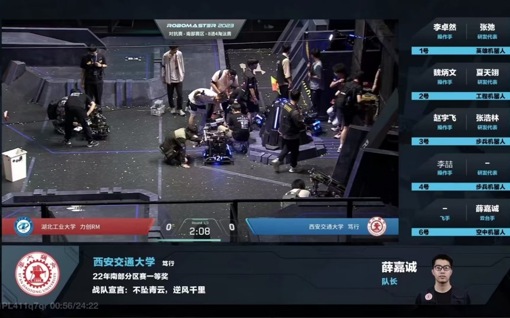

# RoboMaster Experience

## About RoboMaster
RoboMaster, organized by DJI, is an annual robotics competition where university teams design robots to compete in challenges. It emphasizes innovation, teamwork, and technical skills in robotics, including mechanical design, electronics, and software development.

## My Journey in RoboMaster

### 2021: Sentinel Robot Chassis Design
As part of the mechanical team, I designed the chassis for the Sentinel robot, focusing on stability and maneuverability through mechanical engineering principles and structural optimization.

### 2022: Infantry Robot Chassis Design
I designed the Infantry robot chassis, prioritizing speed, durability, and adaptability to various terrains, enhancing the team's competitive performance.

  
  
   
  <em style="display: inline-block; width: 48%;">My first mature competitive robot design, showcasing the team's first competitive robot.</em>

### 2023: Team Captain
As team captain, I led the team to equal its historical best performance, reaching the national top 16. My role involved strategic planning, team coordination, and optimizing robot design and performance.

  
  
   
  <em style="display: inline-block; width: 48%;">Team Captain leading the team during the 2023 RoboMaster competition.</em>
  <em style="display: inline-block; width: 48%;">First champion in the history of our team.</em>

### 2024: Team Advisor
Transitioning to team advisor, I guided the team to break its historical record by reaching the national top 12, showcasing continuous improvement and innovation.

  
   
  <em style="display: inline-block; width: 50%;">Paricipate in trainging completition</em>

## History of Our Team
I am truly honored to have spent my undergraduate years as part of the **DuXing** Robotics Team at Xi'an Jiaotong University. This remarkable team has not only provided me with invaluable friendships but also extraordinary opportunities for personal and professional growth. I sincerely hope that the **DuXing** team will continue to push boundaries, reach new heights, and achieve even greater success in the future.

  
  
   
  <em style="display: inline-block; width: 48%;">Our team's first championship in history (April 2023).</em>
  <em style="display: inline-block; width: 48%;">Returning to Shenzhen for the National Competition after 4 years (August 2023).</em>

  
  
   
  <em style="display: inline-block; width: 50%;">Achieving our team's best historical record - Top 12 (May 2024 - August 2024).</em>

