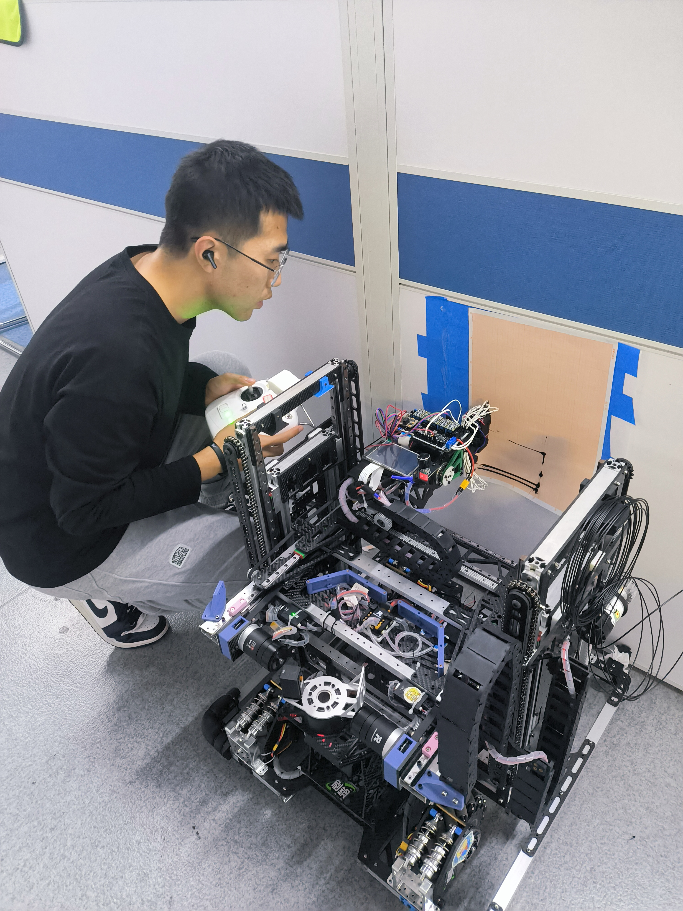
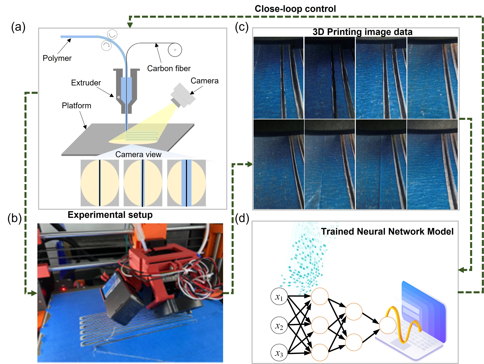

# Xue Jiacheng - Personal Homepage

Welcome to my personal academic homepage. This page provides an overview of my academic background, research interests, projects, publications, and contact information.

## Personal Background

My name is **Xue Jiacheng**, and I am currently a second-year Master's student in the Department of [Your Program Name] at **Xi'an Jiaotong University**. I specialize in the fields of **3D Printing**, **Robotics**, and **AI + Metamaterials**. My academic journey is driven by a passion for exploring the intersection of advanced manufacturing technologies, intelligent systems, and novel materials.

In addition to my academic training, I am focused on understanding the implications and applications of these fields in solving real-world problems. I am now seeking opportunities to further my research at the PhD level, particularly in the United States, where I aim to contribute to ongoing advancements in these cutting-edge areas of study.

## Research Interests

My primary research interests lie in the following areas:

- **3D Printing**: Exploring novel techniques in additive manufacturing, with a particular focus on **online monitoring of 3D printing** using **Convolutional Neural Networks (CNN)** for real-time classification. This approach aims to improve the accuracy, efficiency, and reliability of the 3D printing process by detecting and correcting errors during production.

- **Robotics**: Investigating intelligent systems for automation, including the development of complete robotic systems based on **STM32 microcontroller platforms**. 

- **AI + Metamaterials**: Using **Generative Neural Networks** to perform **inverse design** of **metamaterials**, optimizing their properties such as strength, flexibility, and energy absorption. These AI-driven designs have significant potential for applications in engineering, material science, and physics, allowing for the creation of advanced materials with tailored properties for various functional applications.

I am particularly interested in how these fields intersect, with a goal of creating integrated systems that combine AI-driven optimization with novel material properties to address global challenges.

## Academic Background

I am pursuing my Master's degree in **State Key Laboratory for Manufacturing Systems Engineering** at **Xi'an Jiaotong University**. My coursework in **Mechanical Design Fundamentals**, **Modern Control**, **Material Mechanics**, and **Advanced Machine Learning** has provided a strong foundation in mechanical systems, control theory, material properties, and machine learning, equipping me with the skills needed for my research in 3D printing, robotics, and AI-driven metamaterials design.

In addition to my degree program, I have participated in various research projects, including a three-year involvement in the **RoboMaster Robotics Competition**, where I contributed to the design and development of robotic systems. In my senior year, I served as the **team captain** of a 40-member robotics team, leading the group in strategic planning, system integration, and competition preparation. 

In **July 2024**, I interned at **West Lake Interactive Robotics Company**, where I was responsible for **STM32-based motor control tasks**, focusing on developing control algorithms and hardware integration for robotic motion systems.

## Research Projects

### Project 1: Machine Learning-Based Mechanical Metamaterials Inverse Design and Multi-Objective Optimization
- **Duration:** [Start Date] - [End Date]
- **Research Objective:** The primary goal of this project was to use machine learning algorithms for the inverse design of metamaterials, followed by applying multi-objective optimization algorithms to iteratively optimize the generated metamaterials based on user preferences.
- **Key Technologies:** Deep Generative Neural Networks (GAN), Multi-objective Optimization, Metamaterials, Machine Learning
- **Outcomes:** A set of algorithms for the inverse generation of metamaterials and a multi-controllable optimization scheme was developed.
- **Link to Project:** 
  - [GitHub: RCGAN-MO](https://github.com/logan14925/RCGAN-MO)
  - [Article](https://github.com/logan14925/RCGAN-MO)

### Project 2: Movable 3D Printing Robot
- **Duration:** May 2024 - Present
- **Research Objective:** The objective of this project is to develop a movable robot equipped with a 3D printing device to print large components, aiming to reduce the reliance on traditional large 3D printers for the fabrication of oversized parts.
- **Key Technologies:** Robot design, control systems, 3D printing technology
- **Outcomes:** The basic functionality of the robot has been successfully tested, with the robot able to perform suspended printing on vertical surfaces. The printing error is less than 1mm for every 150mm of printing distance.
- **Link to Project:** 
  - [gitee: MAM-Robot](https://gitee.com/jcXue/mam_-robot)
  

  

### Project 3: Machine Learning-Based Continuous Fiber 3D Printing Process Monitoring
- **Duration:** January 2023 - June 2024
- **Research Objective:** This project focused on using machine learning algorithms to identify and repair defects in real-time during the continuous carbon fiber 3D printing process by adjusting extrusion amounts.
- **Key Technologies:** Convolutional Neural Networks (CNN), Mask-RCNN, Continuous Fiber Reinforced Polymer Composites (CFRPC), 3D printing technology
- **Outcomes:** A real-time monitoring framework for CFRPC 3D printing was developed, enabling automatic defect detection and correction during the printing process.
- **Link to Project:** [Machine Learning-based Online Monitoring and Closed-loop Controlling for 3D Printing of Continuous Fiber Reinforced Composites](https://www.sciencedirect.com/science/article/pii/S2950431725000061)

  

## Contact Information

If you would like to learn more about my research or discuss potential opportunities, please feel free to contact me via the following channels:

- **Email:** xuejiacheng2022@163.com
- **GitHub:** [GitHub](https://github.com/logan14925)

Thank you for visiting my academic homepage. I look forward to discussing future research collaborations and academic opportunities!
